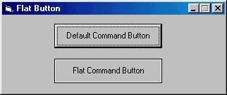



## Flat Button

### Description

Turn any VB default button to Visual C++ Flat Button
 
### More Info
 
Loses its Picture and Other styles set in VB, they can be restored by using APIs

             |
---                |---
**Submitted On**   |2000-03-10 19:19:36
**By**             |[Max Raskin](https://github.com/Planet-Source-Code/PSCIndex/blob/master/ByAuthor/max-raskin.md)
**Level**          |Intermediate
**User Rating**    |4.8 (24 globes from 5 users)
**Compatibility**  |VB 5\.0, VB 6\.0
**Category**       |[Windows API Call/ Explanation](https://github.com/Planet-Source-Code/PSCIndex/blob/master/ByCategory/windows-api-call-explanation__1-39.md)
**World**          |[Visual Basic](https://github.com/Planet-Source-Code/PSCIndex/blob/master/ByWorld/visual-basic.md)
**Archive File**   |[CODE\_UPLOAD39093102000\.zip](https://github.com/Planet-Source-Code/max-raskin-flat-button__1-6517/archive/master.zip)

